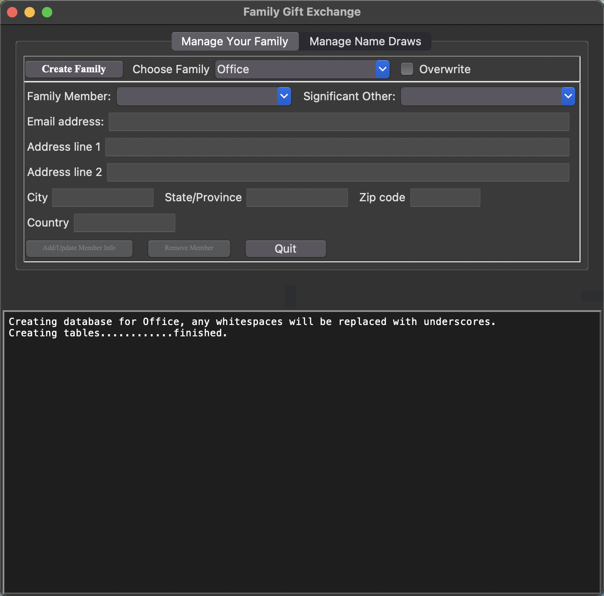

# Family Gift Exchange
A python GUI (planned to be an executable) to manage and run family gift exchanges when it isn't possible for everyone to get together.

## Project Overview
Have you ever wanted to do a holiday gift exchange with friends and family but getting everyone together at the same place at the same time is just logistically and/or geographically impossible?  Well, you've come to the right place.

The FamilyGiftExchange python application allows you to create and manage gift exchanges for multiple families.  Each family is saved in its own sqlite3 SQL database, with email, address, and (if applicable) significant other information; allowing you to manage different sides of the family, friend groups, and even office gift exchanges all in one application.

You can generate name draws for a new year, input gifter-giftee assignments from previous years (if you had been tracking your own gift exchanges manually, for instance, review the exchanges from previous years, and more.

## Installation
I plan to set things up so a standalone executable can be generated with pyInstaller, but that is still a work in progress.

Currently, if you want to try out the application, you can download the repo and call the main file _FamilyGiftExchange.py_ on the command line. Either add the main repo folder to your PATH and type:

`FamilyGiftExchange.py`

or you can navigate to the repo directory and use python directly (a good idea if the shebang in the script doesn't work and the above command fails):

`python FamilyGiftExchange.py`

## Usage
When you start the application for the first time, you'll see something similar to the image below, but the **Create Family** button will be disabeled and not stand out as prominently.  To get started, select the _Choose Family_ dropdown box, which will be empty, and start typing the name of your family, which will activate the button.  White spaces in the name will be removed and replaced with underscores.

{:height="700px" width="700px"}

Now more stuff.

