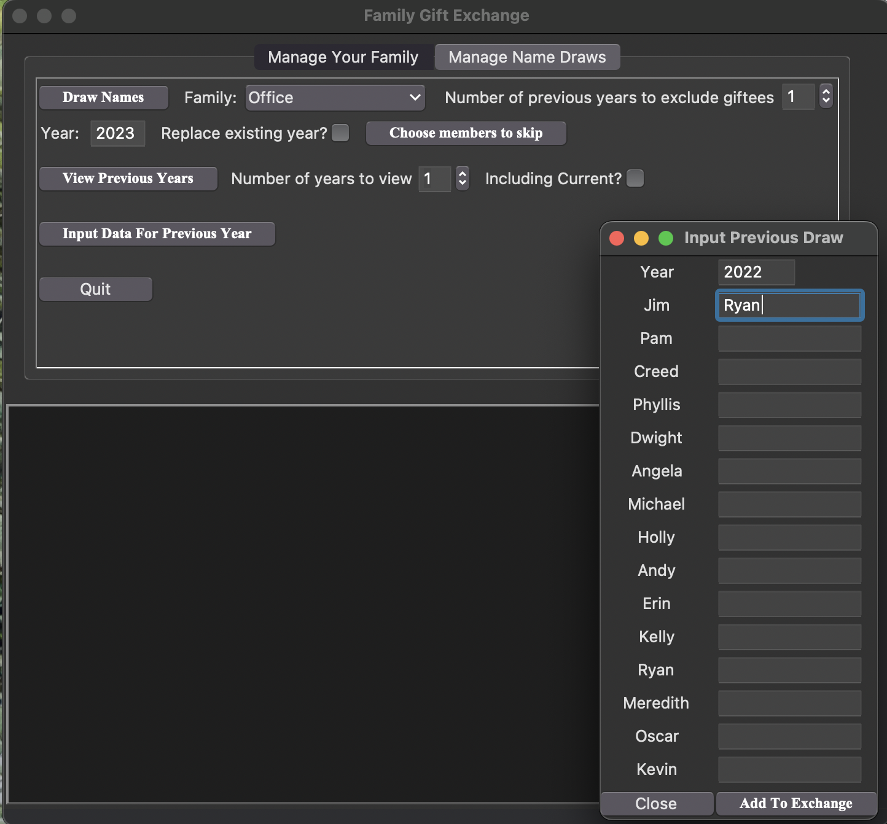

# Family Gift Exchange
A python GUI (planned to be an executable) to manage and run family gift exchanges when it isn't possible for everyone to get together.

## Project Overview
Have you ever wanted to do a holiday gift exchange with friends and family but getting everyone together at the same place at the same time is just logistically and/or geographically impossible?  Well, you've come to the right place.

The FamilyGiftExchange python application allows you to create and manage gift exchanges for multiple families.  Each family is saved in its own sqlite3 SQL database, with email, address, and (if applicable) significant other information; allowing you to manage different sides of the family, friend groups, and even office gift exchanges all in one application.

You can generate name draws for a new year, input gifter-giftee assignments from previous years (if you had been tracking your own gift exchanges manually, for instance, review the exchanges from previous years, and more.

## Installation
I plan to set things up so a standalone executable can be generated with pyInstaller, but that is still a work in progress.

Currently, if you want to try out the application, you can download the repo and call the main file _FamilyGiftExchange.py_ on the command line. Either add the main repo folder to your PATH and type:

`FamilyGiftExchange.py`

or you can navigate to the repo directory and use python directly (a good idea if the shebang in the script doesn't work and the above command fails):

`python FamilyGiftExchange.py`

## Usage

#### Create a "family"

When you start the application for the first time, you'll see something similar to the image below, but the **Create Family** button will be disabeled and not stand out as prominently.  To get started, select the _Choose Family_ dropdown box, which will be empty, and start typing the name of your family, which will activate the button.  White spaces in the name will be removed and replaced with underscores.

<figure>
  

    
  

  

    <figcaption>To create a family, simply enter your family name and press the Create Family button, you will see status messages in the terminal window letting you know if the creation was successful.</figcaption>
  

</figure>

This has done several things.  First, if the main repo didn't contain a directory called _GiftExchange\_Data_, it will attempt to make this directory.  The application will then lood for a subdirectory in that folder called _data\_family\_{family name}_, and make it if it doesn't exist.  Once both directories exist, the application will make an SQL database for your family with four tables:
 * _family_ - will contain columns for an id for each family member as well as their name, email address, and an address\_id key
 * _addresses_ - will contain and columns for a unique id for each address as well as the address itself
 * _significant\_other_ - will contain a column for id, linked to the family table, and a column for the id of that family member's significant other (also lined to the family table)
 * _exchange_ - will contain a column for family member id, tied to the id column in the family table, as well as columns for every year which will eventually contain the id of the family member that person "drew" for the gift exchange.

The .gitignore file knows to exclude the _GiftExchange\_Data_ directory so that your family databases, with names, emails, and addresses; stays only in your version of the repo.

If you select or type in the name of a family for which you already have a database, the **Create Family** button will not be active unless you also check the _overwrite_ box.  However, this will create a second prompt, asking if you're sure as a backup to make sure a database isn't accidentally overwritten (don't worry, a copy of the old database is made and saved in the same directory, just in case so you can rename that old file, but overwriting does get rid of old copies).

#### Add family members

The next step is to start populating the database with family members.  Once the database has been created, just type the name of a new family member and more buttons will become active, as shown in the image below.  The only required field is the name.

<figure>
  

    
  

  

    <figcaption>To add a family member, simply start filling out the information for that individual, starting with their name.</figcaption>
  

</figure>

For the other fields, here are the reasons you might want to fill them out:
 * _Significant Other_ - in the event that people are usually planning to get a gift for their significant other, this information is used to ensure that they don't end up drawing their SO's name.  Note, if the name entered isn't in the database, it will automatically be added.  Also note, the application does not assume that significant others are at the same address, so you'll have to update that information for anyone added to the database in this fashion.
 * _Email address_ - currently, nothing is done with this information.  I have plans to eventually figure out how to integrate the application with email clients so that assignments can be mailed out with the click of a button, but that is not yet implemented.
 * _Address line 1 (et al.)_ - when names are drawn for a given year, a text file is written out for each person, indicating who they have drawn for the exchange.  If the address information is in the database, this information is included if the gift exchange cannot be done in person.

Once you've entered the family member's information, click the **Add/Update Member Info** button to either add them to the database or update some of their information.  Simple as that.

If the member was already in the database, the existing information would have been used to populate the fields and any changes made there will change the database.  If the family member had a significant other, that person will automatically be selected in the _Significant Other_ box, so be aware that any changes made here will propogate to the database.

If for any reason you need to remove a member from the family (if, for instance, you have a family for your office gift exchange and someone moves on to a new job), simply select their name from the _Family Member_ box and click the **Remove Member** button.  Note, this will automatically update the significant other information and, if no one else is at the address associated with that member, remove the address as well.

#### Managing the gift exchange

With everyone added to your family, you're ready to manage the gift exchange itself.  Simply select the _Manage Name Draws_ tab near the top of the application window.  You'll see that whichever family you had selected on the previous tab will automatically be selected.  If you opened the application and went straight here, just select the appropriate family from the drop down box.

The **Draw Names** button is used to create the gift exchange for a given year, but let's walk through the other fields and options first.

If you want to ensure there is more variety in who draws who each year, you can set the _Number of previous years to exclude giftees_ field to some integer value greater than 0 (it will default to 1 and not go above the number of years in the database).  Note, setting this too high may result in not being able to create a name draw, in which case the application will tell you as much.

By default, the _Year_ field will be filled out with the current year, but this can be changed.  If for some reason you need to redo the name draws (hopefully you haven't already emailed out the assignments) check the _Replace existing year?_ box.

If, for some reason, certain family members opt out of the gift exchange for a given years, click the **Choose members to skip** button. This will open up a new window with a check box for every member in the family.  Check the names of individuals _you want to skip_, and then close the window.  These family members will not be assigned any names, and no one will draw their names, for the current gift exchange.

What if you've been running a gift exchange for some time, keeping everything in some other program or written down in an old notebook?  Well, then just click on the **Input Data For Previous Year** button.  You'll see something like what is shown in the image below.

<figure>
  

    
  

  

    <figcaption>An example of inputting information for previous years, before starting to use this application.</figcaption>
  

</figure>

If a family member didn't participate in the draw that year or had the name of someone no longer in the family, leave their name blank.  Any name you type in must be in the database or the **Add To Exchange** button will not be active.  Once you're done entering years (yes, you can do more than one with the same pop-up window), just close the window.

Once you're happy with choosing members to skip and having previous year information to derive excludes for each family member, go ahead and hit the **Draw Names** button.  Inspect the output in the terminal window, but it should be successful, telling you where to find the assignment text files to mail out to family members. (Don't peek! You may be the family member administering the database, but there's no reason you shouldn't be surprised, too.)

If the draw wasn't successful, you may have chosen to exclude gifter-giftee combinations from too many previous years given other constraints (e.g., skipping members and excluding significant others from drawing each other).

Suppose you wanted to view the name draws from previous years for some reason, that's as easy as adjusting the number of years to view value and clicking the **View Previous Years** button.  If you have a need to include the most-recent draw (usually for the current year) in your viewing, make sure the check the _Including Current?_ box.

<figure>
  

    
  

  

    <figcaption>An example of displaying name draw information from previous years.</figcaption>
  

</figure>

Depending on how large your family is, you may need to resize the window to see everyone or simply scroll down.

#### Managing multiple families

If you need to manage multiple families, simply create a new family in the first tab, fill in new family member information, and make name draws for that family following the same instructions.  Even if there is member overlap between the two families, you'll still have to reenter all the information for members in the same family (the application is not currently set up to search other available family databases to prefill that information).

#### Feature requests/bug reports

Please feel free to contact me with ideas for features to add and to report bugs.  Ideally, github makes doing that easy and natural.  This started as a little pet project for my family that I spun into something more expansive, but don't hesitate to reach out if you want to contribute.

#### Planned features progress

 - [ ] Standalone executable and instructions with pyInstaller.
 - [ ] Email client integration. 
 

